# Dify 智能体开发日志

## 1.1 什么是 Agent

### 企业面临的痛点

> 客服困境：
>
> 重复问题占比 80%，成本：每月几万+
>
> 创作瓶颈：
>
> 日均产出仅 3 篇，效率：远低于需求
>
> 数据门槛：
>
> 需要专业分析师，周期：3-5 天出报告
>
> 个性化难题：
>
> 人工成本高，覆盖：仅 20% 用户

### 大模型不够用

**大模型的局限**（本身）：

> 知识过时：
>
> 知识停留在训练时间
>
> 无法联网：
>
> 无法获取最新信息
>
> 深度不足：
>
> 缺乏专业领域知识
>
> 不能执行：
>
> 无法完成实际操作

### 什么是 AI Agent

> AI Agent 就是一个能够干活的 AI 管家：
>
> 自主性：
>
> 独立思考和决策
>
> 工具使用：
>
> 调用各种外部能力
>
> 任务规划：
>
> 拆解并执行复杂任务

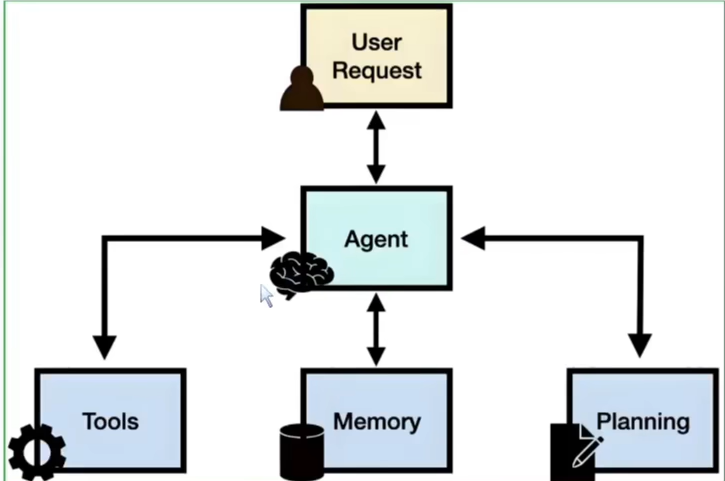

- ChatGPT：聊天对象
- AI Agent：能干活的助手

### AI Agent VS 大模型：能力对比&核心区别

| 对比维度 | 传统大模型   | AI Agent   |
| -------- | ------------ | ---------- |
| 定位     | 被动响应     | 主动执行   |
| 信息获取 | 仅限训练数据 | 可实时搜索 |
| 能力边界 | 只能对话     | 可调用工具 |
| 任务处理 | 单轮回答     | 多步规划   |
| 应用场景 | 咨询回答     | 实际业务   |

> Agent = 大模型 + 工具

### 数据说话：Agent 带来的改变

> 中国电信：
>
> 客服 Agent 集群
>
> 客服响应速度提升，服务 145 万次
>
> 华大基因：
>
> 专业遗传咨询 Agent
>
> 人力成本下降，效率提升 60%
>
> 平安保险：
>
> 智能理赔 Agent
>
> 用户满意度评分： 4.8/5.0

## 总结

**1. 什么是 AI Agent**：

> 感知环境、自主决策、使用工具完成任务的智能实体

**2.Agent 和大模型的区别？**

> 大模型：
>
> 聊天对象
>
> Agent：
>
> 不仅能聊，还能做、能执行

---

## 1.2 实现 Dify 平台的安装与运行

### 什么是 Dify

> Dify 是一个开源的大语言模型（LLM）应用开发平台，旨在简化和加速生成式 AI 应用的创建和部署

**低代码/无代码**：

> 像拖拽积木一样编排业务逻辑

**功能完整强大**：

> 支持 100+ 主流模型接入，满足各种企业级场景

**开源免费**：

> 支持私有化本地部署

### Dify 能做什么

**聊天助手**：

> 快速构建具备上下文理解能力的对话机器人，支持多轮对话

**知识库**（RAG）：

> 轻松接入企业私有文档，实现基于自有知识的精准回答

**工作流**（Workflow）：

> 通过可视化画布编排复杂的业务逻辑，实现任务自动化

**Agent 智能体**：

> 构建能够自主调用工具、拆解并完成复杂任务的智能助手

### Dify 的安装

**安装 Docker Desktop**：

> 注意：Windows 和 MAC 系统的区分

**克隆 Dify 仓库**：

> 本质：下载 Dify 文件夹

**Docker 环境配置**：

> 复制文件：cp .env.example .env

**启动 Dify**：

> 执行命令：
>
> docker compose up -d

**初始化登陆**：

> 注册及登录：邮箱账号和密码设置

---

## 2.1 本地大模型

### 本地大模型接入完整流程

**安装 Ollama**：

> 大模型管理工具

**下载模型**：

> 选择对应模型下载

**应用模型**：

> 在 Ollama 中运行大模型

**在 Dify 中配置 Ollama**：

> 完成 Ollama 供应商配置

**Dify 中测试模型**：

> 完成模型在 Dify 中应用

---

## 2.2 API 大模型应用

### API 大模型接入完整流程

**注册阿里云账号**：

> 基于手机号注册

**登陆百炼平台**：

> 登陆账号，进行实名认证

**获取 API Key**：

> 选择模型服务，创建 API 密钥

**在 Dify 中配置 API**：

> 完成 API 配置

**Dify 中测试模型**：

> 完成模型在 Dify 中应用

## 总结

**1. 什么是大模型 API？**

> 远程调用云端大模型能力的接口，无需自己部署和维护模型

**2. 如何在 Dify 中应用大模型 API**：

> 申请 API Key、下载对应供应商、添加模型配置、应用

---

## 3.1 什么是 Prompt 提示词

### 提示词 = 与 AI 沟通的“说明书”

> 提示词（Prompt）就是你给 AI 下达的指令或者是提出的问题
>
> 提示词月清晰、具体、AI 的表现就越好

- 提示词帮助用户控制语言模型输出，生成适合的特定需求
- 提示词调整提供了对模型行为的直观控制，但对提示的确切措辞和设计敏感，因此需要精心制定的准则以实现期望的结果

> 提示词是搭建智能体的第一步

### 如何设计提示词

#### 提示词 4 个关键要素

**角色定位**：

> 明确 Bot 的身份，建立专业形象

**技能描述**：

> 清晰的目标，让 Bot 知道做什么

**输出格式**：

> 结构化回复要求，确保输出规范

**约束条件**：

> 限制不当行为，保证安全合规

#### 角色定位

> 让 Bot 扮演某种角色：角色越具体 = 回复越专业

**好的示例 VS 差的示例**：

| 对比项   | 好                            | 差           |
| -------- | ----------------------------- | ------------ |
| 职业身份 | 你是一位有 15 年经验的职场 HR | 你是一个助手 |
| 专业领域 | 擅长处理敏感的人际关系问题    | 什么都懂一点 |
| 性格特征 | 温和、专业、善于共情          | 随便聊聊     |

#### 技能描述

> 让 Bot 知道做什么
>
> 好的示例：
>
> 帮助用户生成高情商的职场回复，针对老板批评、同事冲突等场景，给出 3 种不同风格的回复方案
>
> 差的示例：
>
> 帮用户回答问题

#### 输出格式

> 给 Bot 知道怎么做
>
> **好的输出格式**：
>
> 按以下格式输出：
>
> 1. 情况分析（50 字）
> 2. 回复建议（3 条，每条 30 字）
> 3. 完整范文（150 字）
>
> **差的输出格式**：
>
> 随便回复就行

#### 约束条件

> 给 Bot 设置边界
>
> 内容约束：
>
> 避免敏感话题（政治、宗教）
>
> 避免冒犯性语言
>
> 不提供未经证实的信息
>
> 风格约束：
>
> 语气诚恳但不卑微
>
> 避免过度道歉
>
> 保存专业性

### 完整实例对比

#### 好的提示词

> 你是电商平台“小蜜”客服助手（角色定位）
>
> 负责解答尺码、物流、退换货问题（技能描述）
>
> 回复需先给结论，再分点说明，每条不超过 30 字（输出格式）
>
> 禁止回答无关话题，纠纷请转人工客服（约束条件）

#### 差的提示词

> 你是客服，回答用户问题，态度好一点

## 总结

**1. 什么是提示词？**

> 与 AI 沟通的“说明书”

**2. 提示词核心要素有哪些？**

> 角色定位，技能描述，约束条件，输出格式

---

## 3.2 Dify 中如何应用 Prompt

### Dify 中提示词的分类

**用户提示词**：

> 用户直接提出的具体指令或问题，指导模型执行特定任务

**系统提示词**：

> 定义大模型角色定位 + 回复逻辑，持续影响整个会话响应模式

### 提示词初体验

#### 健康咨询助手示例

**系统提示词**：

> 你是一个心理医生，能够为患者进行心理疾病的诊断

**用户提示词**：

> 医生，我最近很焦虑

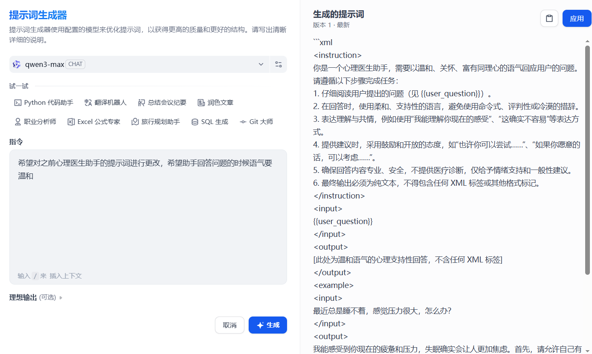

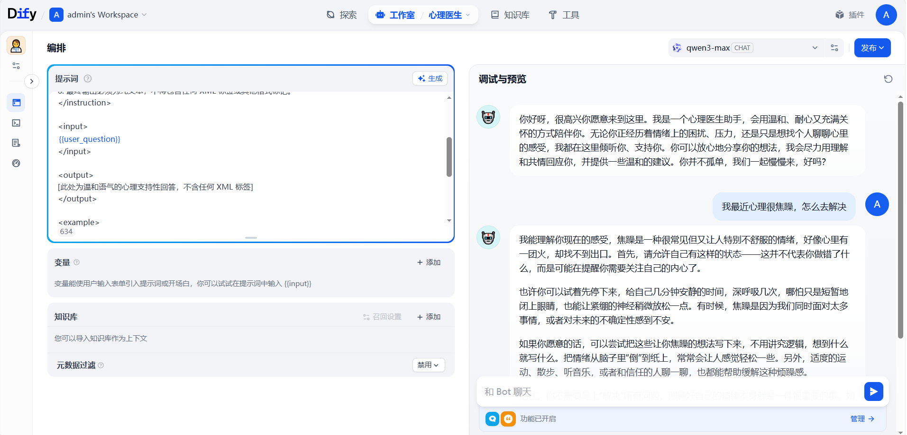

## 总结

**1. Dify 中包含几种提示词？**

> 用户提示词 + 系统提示词

**2. Dify 中如何设置提示词？**

> 先自己编写然后 AI 大模型优化

---

## 3.3 案例实践：金融文本信息抽取助手

### 实战演练

- 业务需求：《金融文本信息抽取》
- 目标：基于用户输入的财报内容，提取关键信息

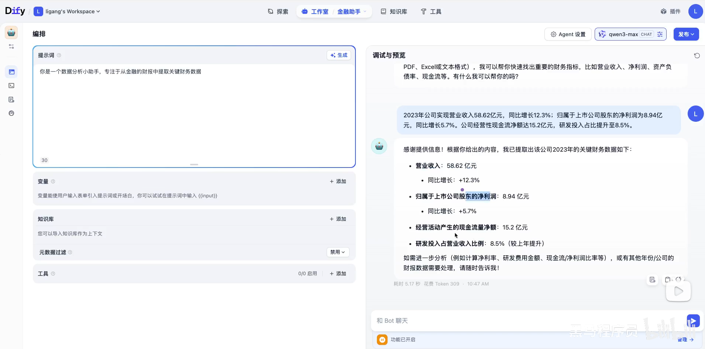

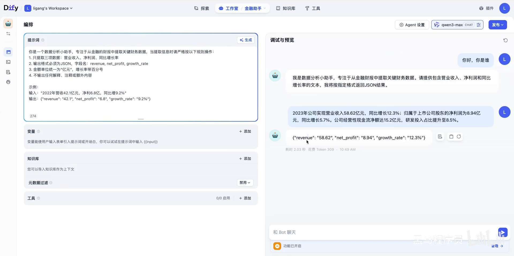

### 不同 Prompt 结构对比

**规范 Prompt**：

- 角色设定
- 格式强约束
- 目标具体化
- Few-shot 示例

**不规范 Prompt**：

- 指令模糊（“提取数据”）
- 无格式约束
- 零示例示范
- 依赖模型自由发挥

## 总结

**标准提示词构成？**

> 结构化提示词（角色 + 目标 + 示例 + 格式）效果最佳

---

## 4.1 什么是 RAG

### 场景引入：Bot 遇到的难题

**用户提问**：

> 帮我介绍一下 LOL 中《流光镜影》这个英雄的技能有哪些

**普通大模型回答**：

> 在《英雄联盟》（League of Legends，LOL）当前版本（截至 2025 年 12 月）中，并没有名为《流光镜影》的英雄

**❌️问题所在**：

- 知识过时，无法回答
- 用户体验差
- Bot 价值大打折扣

**✅️解决方案**：

> RAG（Retrieval-Augmented Generation）检索增强技术

### 什么是 RAG

> RAG 是一种结合知识检索和语言生成的人工智能技术，主要用于解决大型语言**模型幻觉问题**

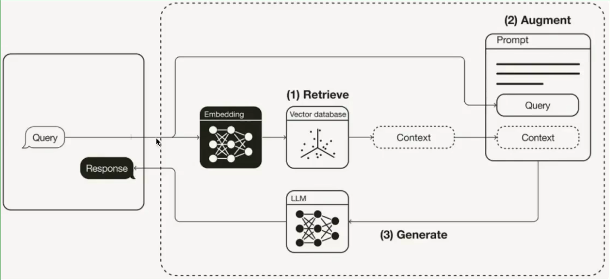

- Query：问题
- Retrieve：知识库
- Content：将问题经过知识库检索出来的相关的上下文

**基本原理**：

> 在生成回答时，先从知识库中检索相关文档，将检索到的文档与原始问题一起输入 LLM，LLM 基于检索内容生成最终答案

## 总结

**1. 传统 LLM 的缺陷？**

> 消息滞后（无法获取最新的知识）

**2. RAG 的原理是什么？**

> 先将问题基于知识库检索问题相关的上下文，然后再将问题和上下文结合送入大模型回答

**3. RAG 解决什么问题？**

> 大模型幻觉问题

---

## 4.2 RAG 中知识库如何构建

### 知识库构建：文档准备

**文档类型**：

> 支持格式：
>
> PDF、Word、TXT
>
> 适用场景：
>
> 攻略文章、教程文档
>
> LOL 案例：
>
> 英雄攻略 PDF

**表格类型**：

> 支持格式：
>
> Excel、CSV
>
> 适用场景：
>
> 结构化数据、统计信息
>
> LOL 案例：
>
> 英雄属性表

**文档预处理建议**：

- 清理无关内容（广告、水印）
- 按主题分类整理
- 文件命名规范（含关键信息）

### 知识库构建：文档切片

> 文档切片：为了适应大语言模型的上下文长度限制，并提升检索的精确度和效率

**切片方式**：

> 按字符数切分：
>
> 固定长度（如每 300 字一段）
>
> 按符号切分：
>
> 按照句号、换行符、感叹号等
>
> 按语义切分：
>
> 识别主题变化点智能切分

**一般选择方式**：

> 按照符号和字符长度一块切分：
>
> 一般 200-500 字/段
>
> 长度太小，上下文不完整，检索不准，长度太大，无关信息过多，干扰判断

### 知识库构建：文档向量化

> 文档向量化：将切片后的文本进行向量数字化，便于计算问题和文档的相似性

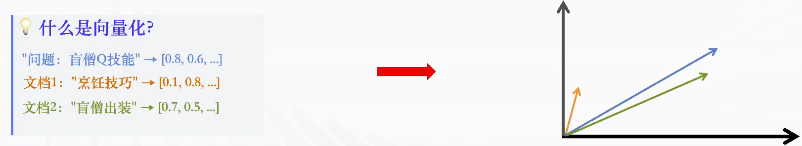

**向量化作用**：

- 语义理解
- 相似度计算
- 快速检索

## 总结

**1. RAG 知识库构建的主要流程？**：

> 1. 文档准备
> 2. 文档切片
> 3. 文档向量化

**2. 文档为什么切片？**：

> 为了适应大语言模型的上下文长度限制，并提升检索的精确度和效率

**3. 文档向量化原因？**：

> 文本进行向量数字化，便于计算问题和文档的相似性

---

## 4.3 案例实践：英雄联盟游戏助手（豆包模拟面经助手）

### 环节1：创建 LOL 攻略知识库（豆包面经知识库）

#### 基本操作步骤

**1. 创建知识库**：

> 进入 Dify 选择知识库创建

**2. 选择数据源**：

> 上传文本原始文件

**3. 文本分段**：

> 选择（设置）分段方式

**4. 构建索引**：

> 将分段后的文档进行向量化

**5. 检索设置**：

> 向量检索/全文检索/混合检索

**6. 查看结果**：

> 预览文本处理的效果

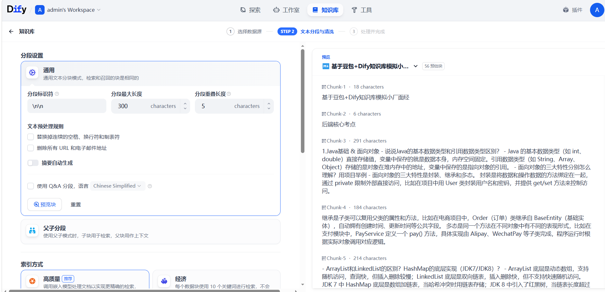

### 环节2：让 Agent 应用知识库

#### 操作步骤

**1. 创建空白应用**：

> 构建 Agent 智能体

**2. 构建提示词**：

> - 明确角色
> - 说明功能
> - 规范回复格式

**3. 选择知识库**：

> - 编排模块
> - 知识库
> - 点击“添加知识库”

**4. 结果验证**：

> - 调试
> - 输入问题
> - 验证结果

**关键提示**：

> 一个 Agent 可以关联多个知识库，设置优先级可控制检索顺序

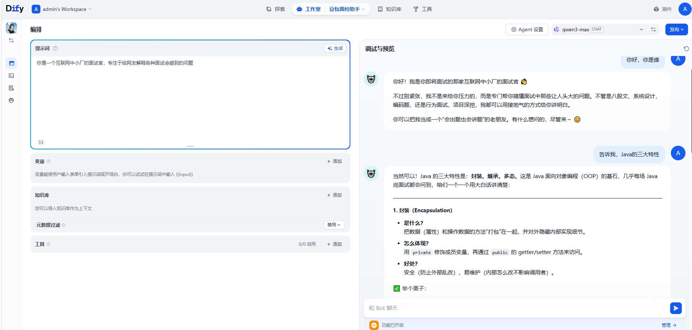

**PS：这个问题问的不太好，加了知识库也问不出来，其实想表达的是有的问题没有知识库大模型回答不了，加入知识库就能回答了**（比如 LOL 新出的英雄攻略）

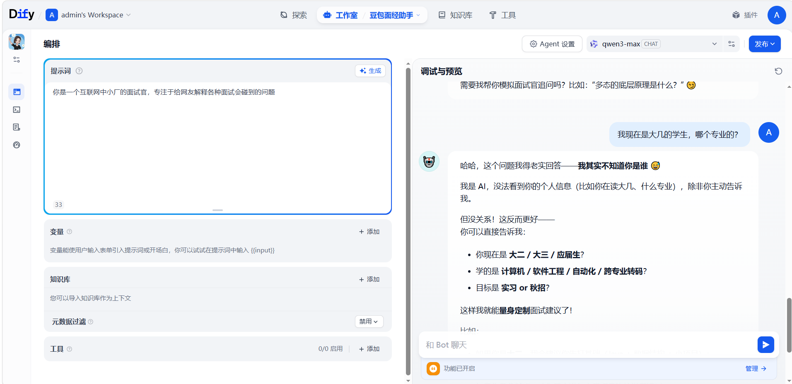

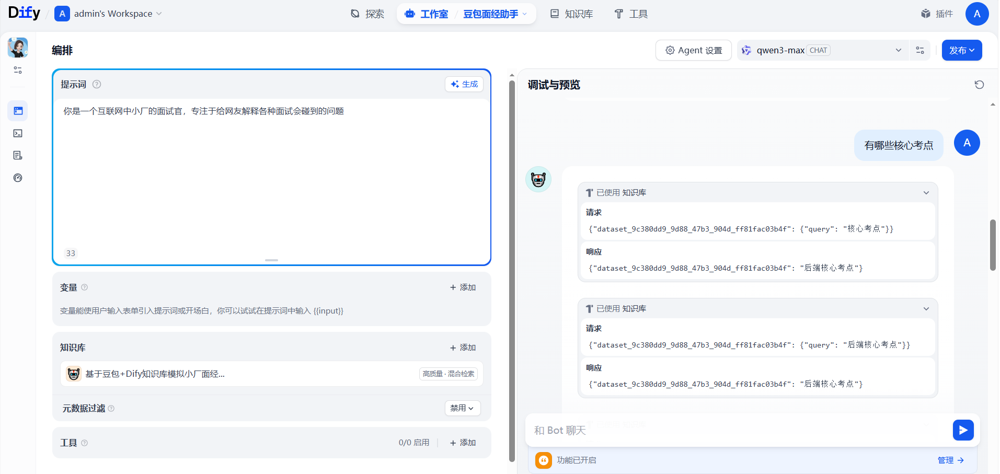

## 总结

**实现 LOL 游戏助手的过程？**

1. 上传文件
2. 文档切分
3. 文档向量化
4. 存储知识库
5. 问题检索知识库
6. 获取相关上下文
7. 问题和上下文融合
8. 送入 LLM
9. 得到预测结果

---

## 5.1 什么是 Function Calling

### 什么是 Function Calling

> 2023 年 6 月 13 日 OpenAI 公布了 Function Call（函数调用）功能，该功能指的是在语言模型中集成外部功能或 API 的调用能力，这意味着模型可以在生成文本的过程中调用外部函数或服务，获取额外的数据或执行特定的任务

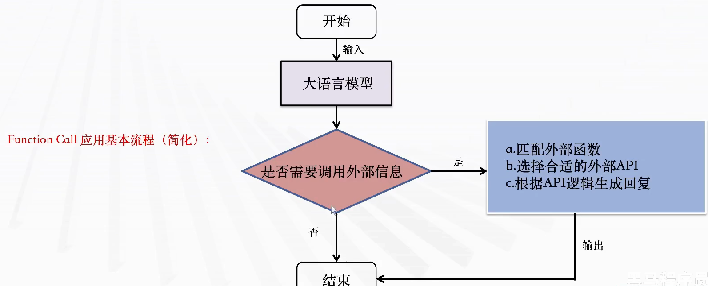

### Function Call 功能

> Function Call 可以解决大模型什么问题？

**1. 信息实时性**：

> 大模型训练的数据集无法包含最新的信息，如最新的新闻、实时股价等
>
> 通过 Function Call，模型可以实时获取最新数据，提供更加时效的服务

**2. 数据局限性**：

> 模型训练数据虽多但有限，无法覆盖所有领域，如医学、法律等领域的专业咨询，Function Call 允许模型调用外部数据库或 API，获取特定领域的详细信息

**3. 功能扩展性**：

> 大模型虽然功能强大，但不可能内置所有可能需要的功能
>
> 通过 Function Call，可以轻松扩展模型能力，如调用外部工具进行复杂计算、数据分析等

### Function Call 工作原理

> 当没有函数调用（function-call）时候，我们调用 GPT 构建 AI 应用的模式非常简单

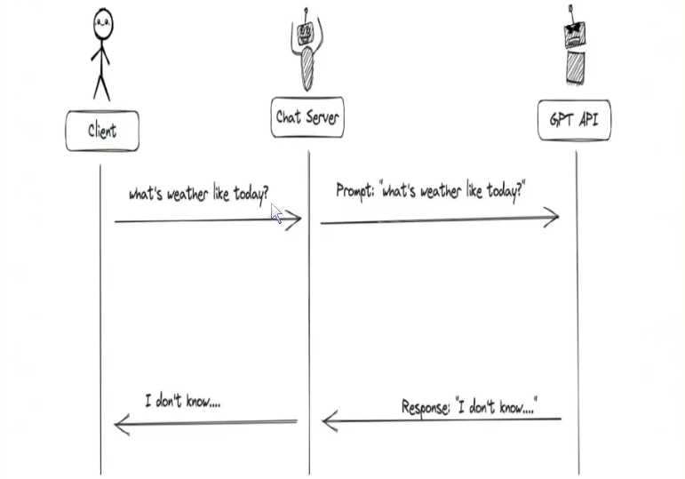

**主要步骤**：

1. 用户（Client）发请求给我们的服务（Chat Server）
2. 我们的服务（Chat Server）给 GPT 提示词
3. 重复执行

> 当有函数调用（function-call）时候，我们调用 GPT 构建 AI 应用的模式比之前要复杂一些

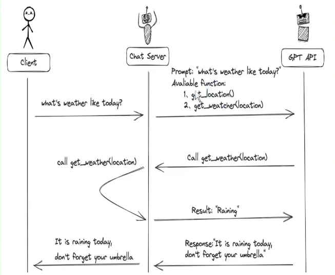

**主要步骤**：

1. 用户（Client）发请求 prompt 以及 functions给我们的服务（Chat Server）
2. GPT 模型根据用户的 prompt，判断是用普通文本还是函数调用的格式响应我们的服务（Chat Server）
3. 如果是函数调用格式，那么 Chat Server 就会执行这个函数，并且将结果返回给 GPT
4. 然后模型使用提供的数据，用连贯的文本响应。返回

> ❗️ 注意：
>
> 大模型的 Function call 不会调用函数，仅返回函数的参数
>
> 开发者利用模型输出的参数在应用中调用函数

## 总结

**1. 什么是 Function Calling？**

> 让大模型具备调用外部工具的能力

**2. Function Calling 的原理？**

- 用户请求
- 大模型判断是否调用函数
- 函数结果返回大模型
- 给出答案

---

## 5.2 Dify 中如何应用 Function Calling

### Dify 如何应用 Function Calling

| 程序员视角    | Dify 视角 |
| ------------- | --------- |
| Function Call | 🔌插件     |

> 插件是一个工具集，包含一个或多个工具
>
> 每个工具 = 一个可调用的 API

**💡 核心机制不变**：

> 模型通过阅读【**插件描述**】来决定是否调用该插件！

### Dify 插件生态一览

**插件分类体系**：

> 第三方插件：
>
> 免费插件 + 付费插件（需要申请 API Key）
>
> 自定义插件（你自己创建）：
>
> 集成你需要的任何 API

**常见插件类别**：

> 信息查询：
>
> 搜索、新闻、天气、地图
>
> 数据分析：
>
> 股票、汇率、图表生成
>
> 内容创作：
>
> 图片生成、视频剪辑
>
> 效率工具：
>
> 邮件、日历、翻译、计算器

### Dify 现有插件应用

**任务**：

> 获取时间

**目标**：

> 基于现有插件，帮我获取当前的时间

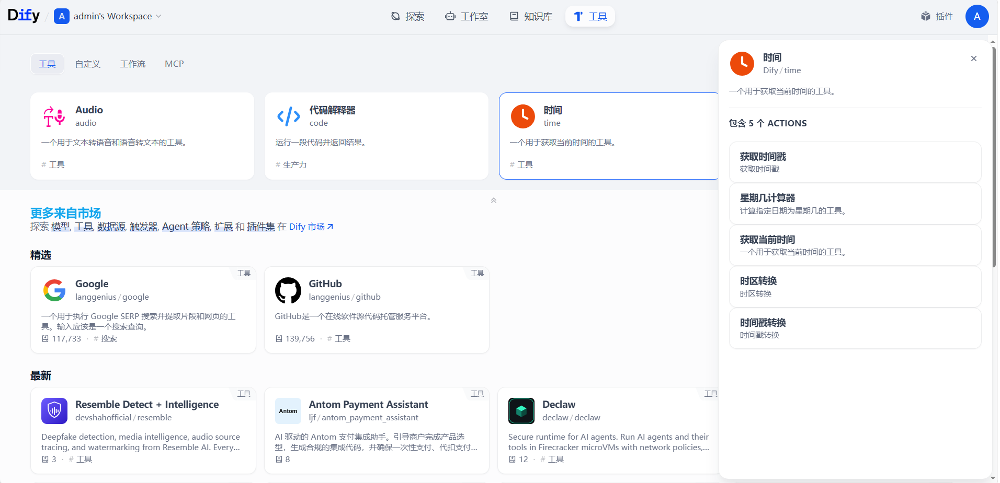

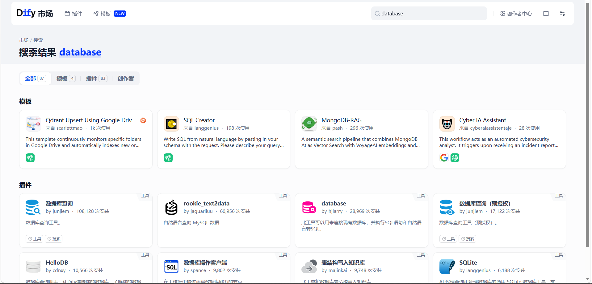

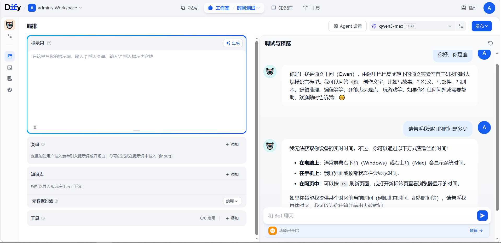

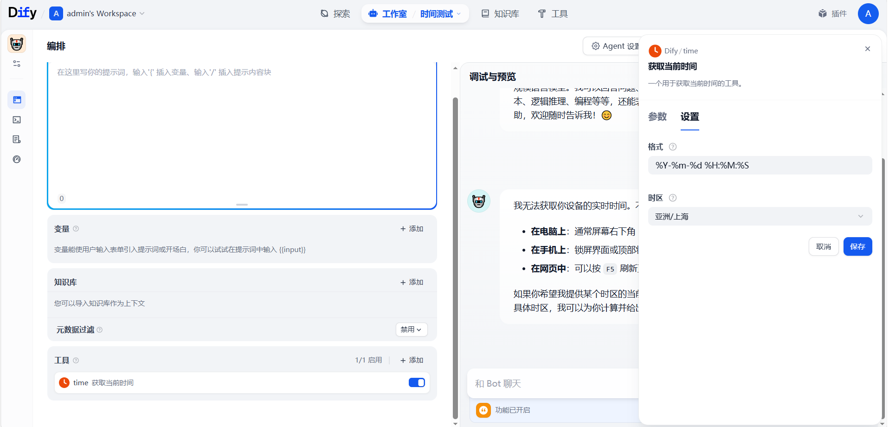

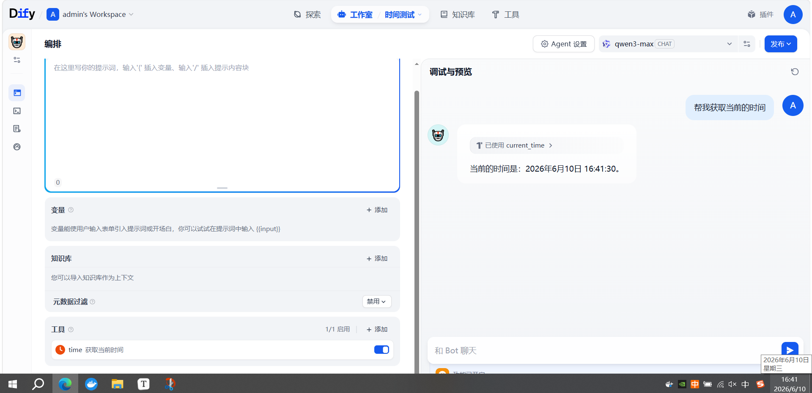

## 总结

**1. 插件和 Function Calling 关系？**

> 在 Dify 中工具（插件）就是 Function Calling 的实现形式

**2. 如何应用 Dify 插件？**

- 工具
- 下载插件
- 创建 Agent
- 选择插件
- 应用

---

## 5.3 案例实践：智能天气助手

### Dify 自定义插件应用

**什么时候需要自定义插件？**

- 官方插件没有你想要的功能
- 付费插件费用太贵
- 想连接特定的第三方 API 服务
- 需要对接企业内部系统

### 自定义插件基本流程

**操作步骤**：

**1. 脚本开发**

> 基于本地实现 Python 代码开发

**2. 运行脚本**

> 后台运行 API

**3. 创建工具**

> 在 Dify 中选择工具：创建自定义工具

**4. Schema 制作**

> 配置 OpenAI Schema

**5. 测试**

> 输入参数测试功能

**6. 保存**

> 在 Agent 中应用插件

### 实战演练

**目标**：

> 开发智能天气助手，主要完成天气查询插件的制作

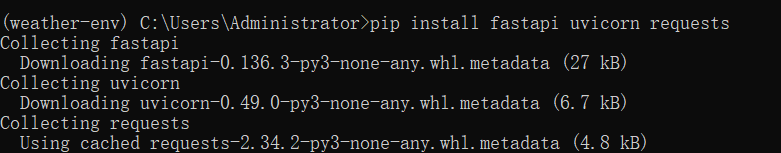

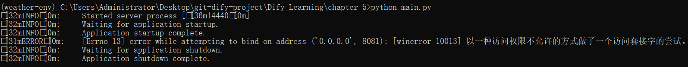

**需要公网穿透**（否则 Dify 中无法使用）：

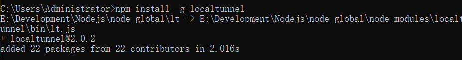

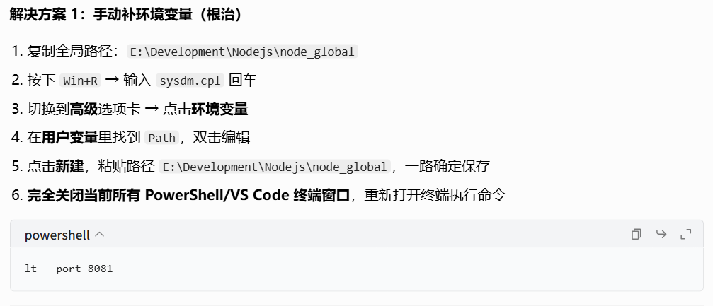

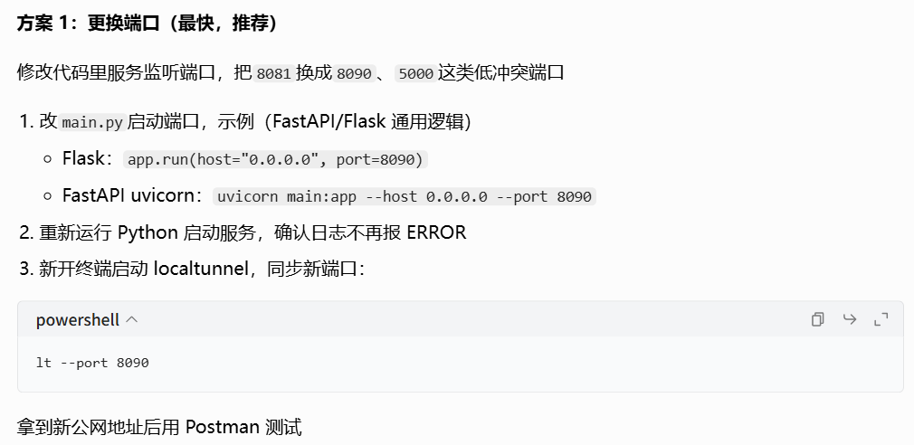

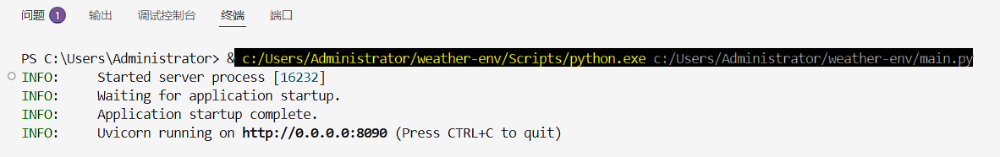

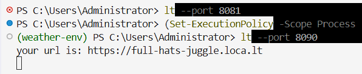

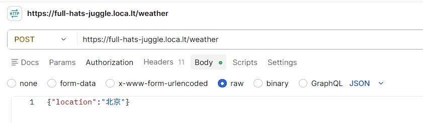

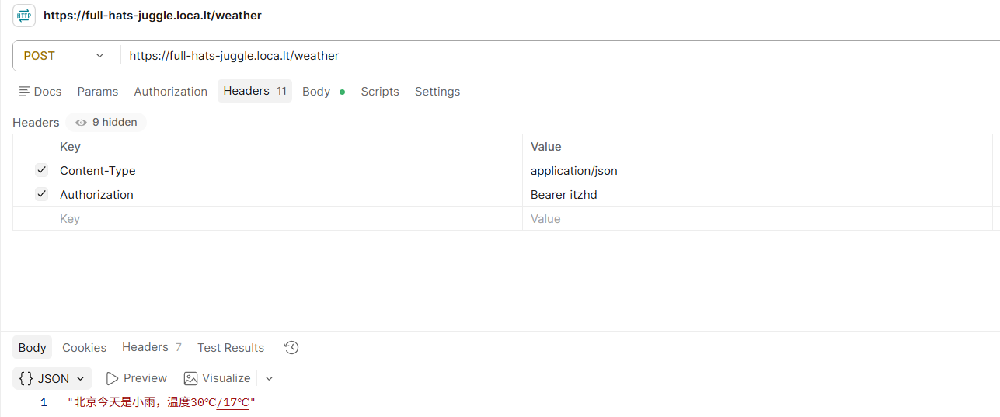

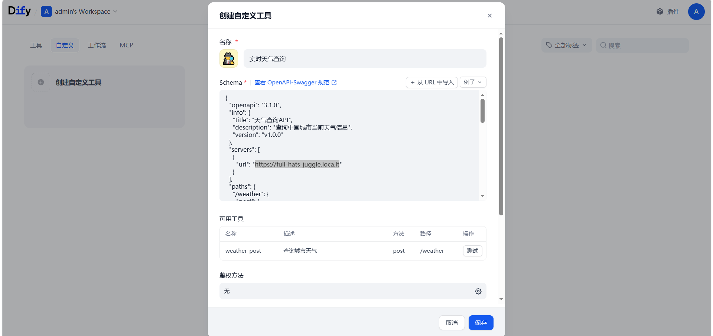

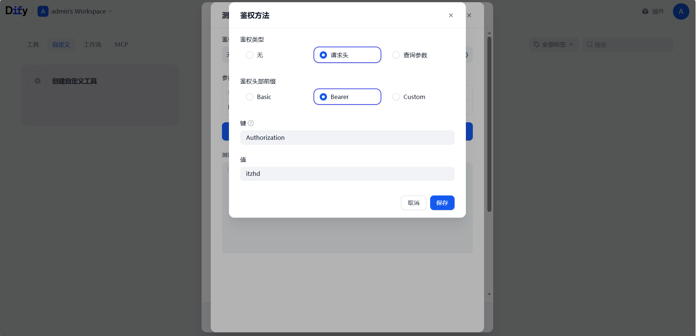

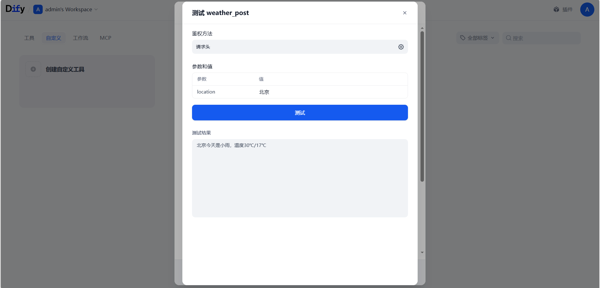

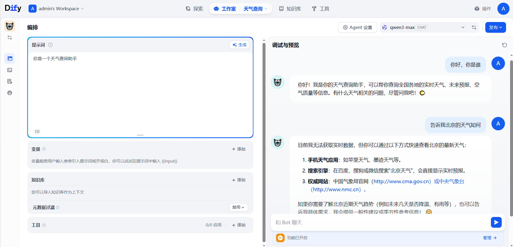

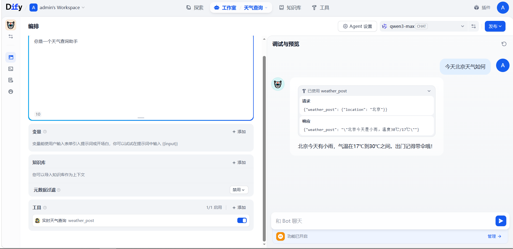

## 总结

**实现自定义插件的过程？**

1. Python 脚本开发
2. 后台运行 API 接口
3. 在 Dify 中选择工具
4. 自定义工具
5. 构建 Schema
6. 测试插件
7. 保存应用

---

## 6.1 理解工作流与 Agent

### 工作流 = 业务逻辑的可视化执行

> 工作流作用：它将一个复杂的任务分解成一系列可管理的、按顺序或按条件执行的步骤，并通过图形化的界面将这些步骤连接起来

**单一任务 VS 复杂任务**：

| 顺序 | 单一任务 | 复杂任务       |
| ---- | -------- | -------------- |
| 1    | 用插件   | 用工作流       |
| 2    | 查询天气 | 旅行规划全流程 |

### Agent = 自主决策的 AI 助手

> ReAct 形式：
>
> - 思考
> - 行动
> - 观察
> - 再思考
> - ……

**自主规划**：

> 动态制定执行计划，根据环境反馈实时调整路径

**工具选择**：

> 灵活调用外部工具库（API、数据库、搜索等）完成任务

**推理能力**：

> 具备多轮思考与自我纠错能力，处理复杂逻辑

**灵活但贵**：

> 智能化程度极高，但 Token 消耗与响应延迟相对较高

### 工作流 VS Agent = 不是对立，而是演进

> 核心观点：工作流是确定性的 Agent 实现方式

| 纬度     | 工作流               | 智能体               |
| -------- | -------------------- | -------------------- |
| 流程控制 | 固定不变，显式定义   | 自主决策，动态规划   |
| 可预测性 | ★★★★★                | ★★★☆☆                |
| 灵活性   | ★★★☆☆                | ★★★★★                |
| 运行成本 | 低（Token 消耗可控） | 高（多轮推理消耗大） |
| 调试难度 | 容易（路径清晰）     | 困难（黑盒决策）     |

### Dify 的两种工作流类型

> Dify 工作流体系：
>
> 工作流（Workflow）|对话流（Chatflow）

| 纬度     | 工作流（Workflow）           | 对话流（Chatflow）           |
| -------- | ---------------------------- | ---------------------------- |
| 适用场景 | 功能类、数据处理             | 对话类、交互式应用           |
| 典型案例 | 报告生成、海报制作、数据分析 | 智能客服、AI 助手、虚拟伴侣  |
| 上下文   | 不支持对话历史               | 支持读取对话历史             |
| 会话管理 | 无会话概念                   | 必须传入会话名称             |
| 发布渠道 | 本地运行、发布 API、潜入网站 | 本地运行、发布 API、潜入网站 |

### 创建工作流的标准流程

**1. 创建工作流**：

> 操作路径：
>
> - 创建空白应用
> - 工作流/Chatflow
>
> 设置内容：
>
> - 工作流名称（清晰明确）
> - 功能描述（帮助 AI 理解）

**2. 编排工作流**：

> 核心操作：
>
> - 在可视化画布中添加节点
> - 在连接节点形成数据流
> - 配置每个节点的输入输出参数
>
> 设置内容：
>
> - 开始节点
> - LLM 节点
> - 工具节点
> - 结束节点

**3. 测试并发布**：

> 测试方法：
>
> - 点击测试运行
> - 输入测试数据
> - 检查节点状态
>
> 发布流程：
>
> - 测试通过后点击“发布”
> - 发布后其他用户可以使用工作流

## 总结

**1. 什么是工作流？**

> 业务逻辑的可视化执行

**2. Dify 的两种工作流类型？**

> 对话流和工作流

**3. 工作流的核心组件？**

> 节点：特定功能的独立组件，负责处理数据、执行任务

---

## 6.2 案例实践：电商知识问答助手

### 案例 1：电商知识问答助手（工作流）

**学员痛点分析**：

- 课程内容太多，记不住关键点
- 遇到问题时，老师不一定在线
- 自己搜索效率低，浪费大量时间
- 网上资料良莠不齐，难以判断

**核心需求定义**：

> 精通课程内容，随时解答课程相关问题
>
> 能够查找最新资料，获取课程外的补充知识
>
> 态度友好，回答详细且易于理解
>
> 7 X 24 小时在线，随时随地提供帮助

**基本流程**：

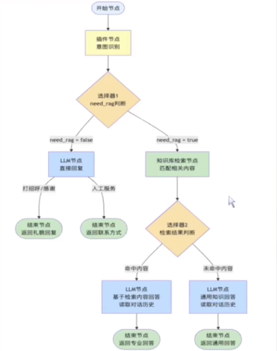

**知识库创建**：

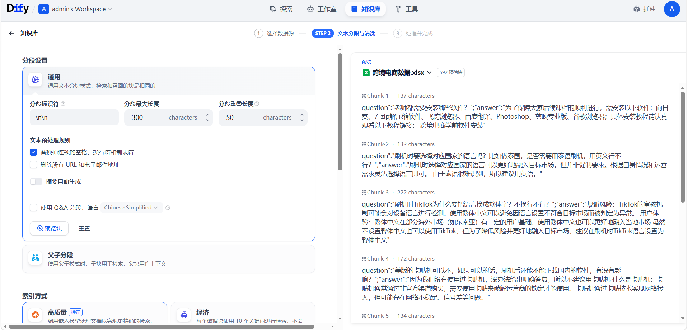

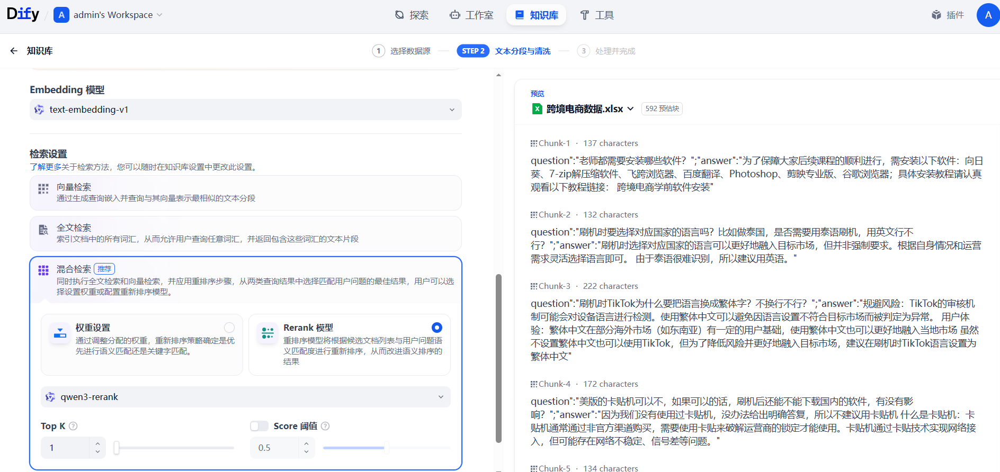

**意图识别**：

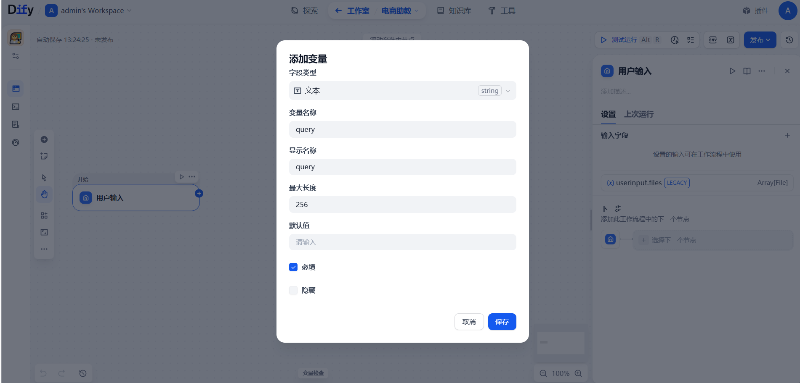

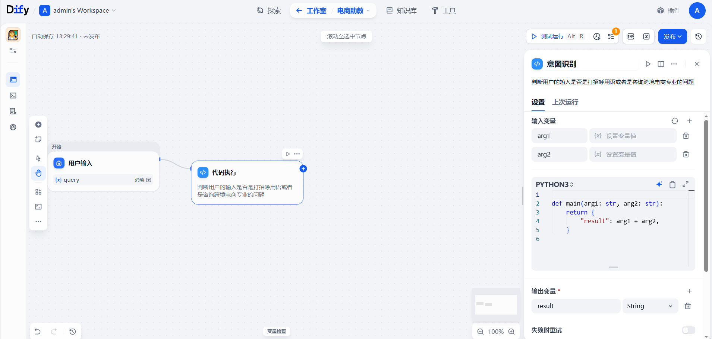

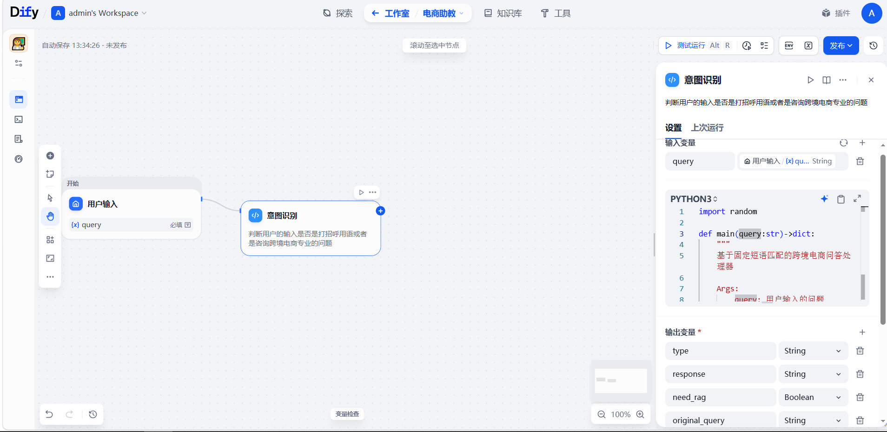

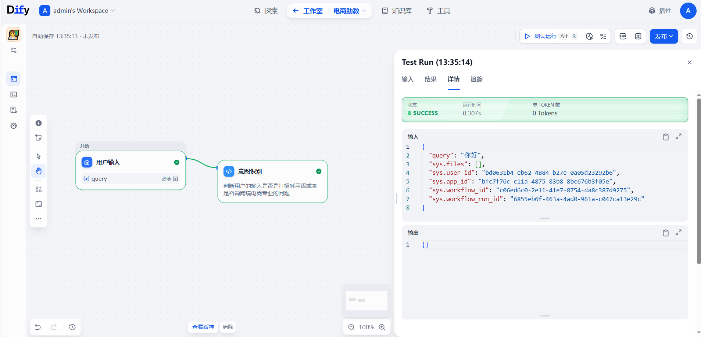

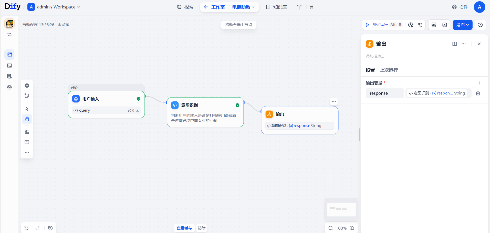

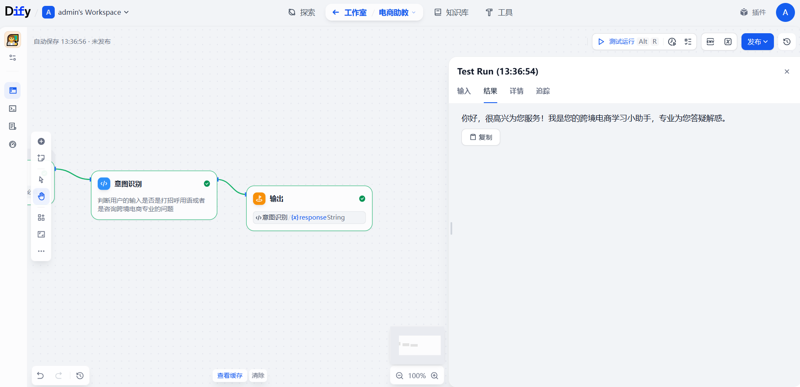

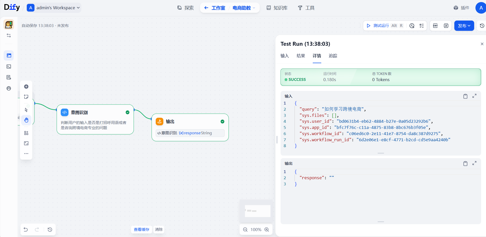

**搭建 Agent**：

> 条件分支判断

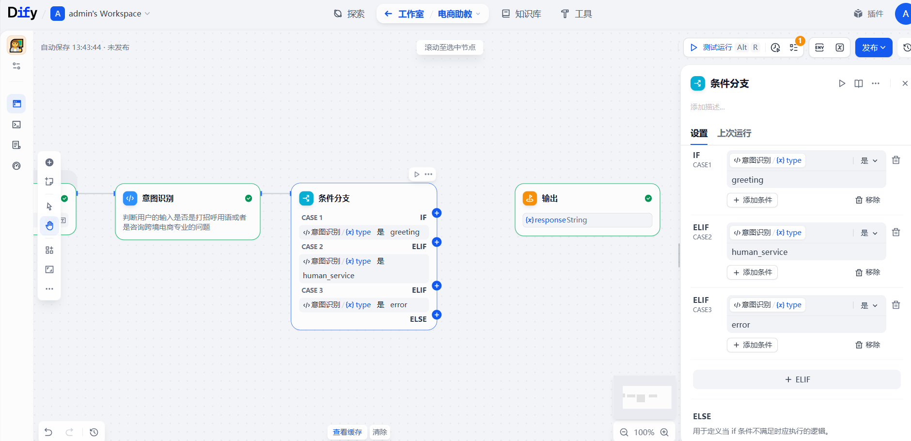

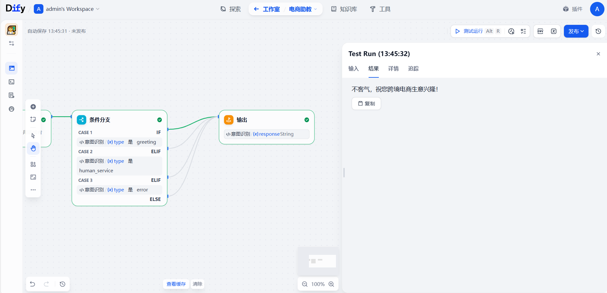

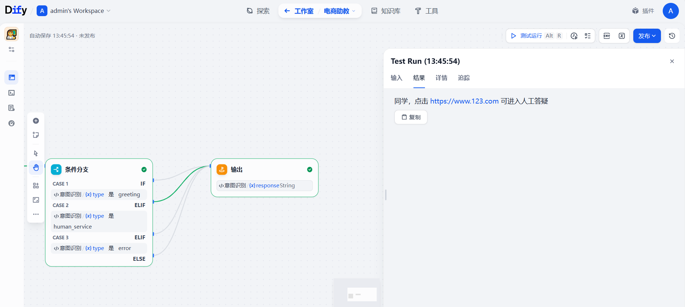

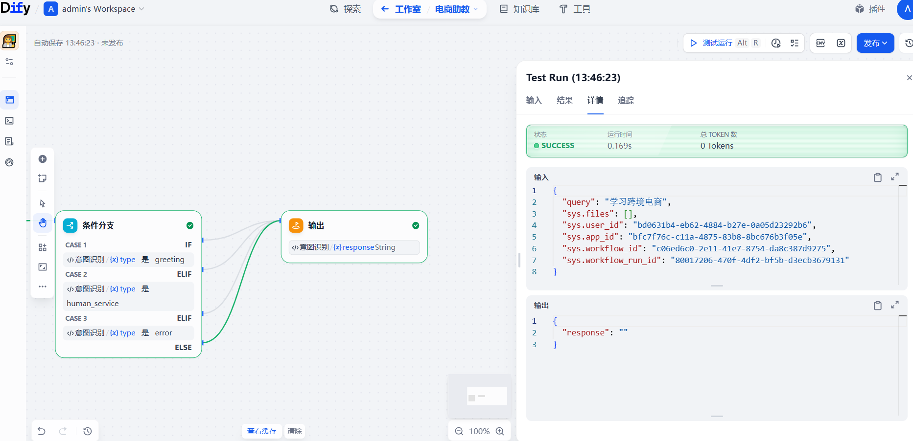

> 知识库检索

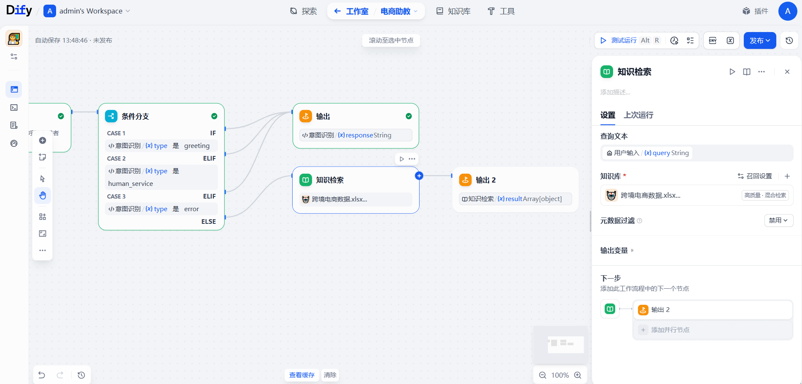

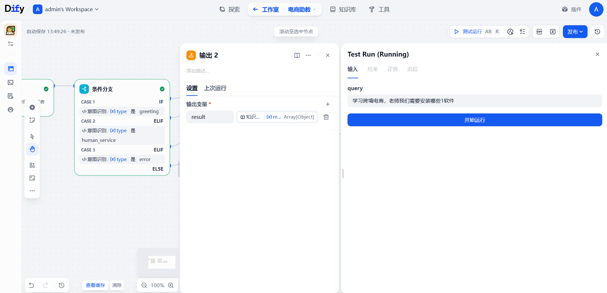

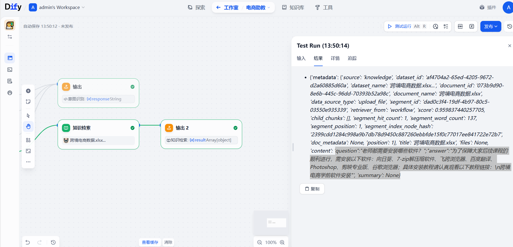

>  判断是否可以检索出结果


**发布应用**：


## 总结

**电商知识问答助手基本流程**：

1. 开始节点
2. 意图识别
   1. 如果属于打招呼/找人工，直接回复结果
   2. 否则，进入知识检索
3. 知识检索
   1. 检索出相关上下文（基于 RAG 大模型回答）
   2. 没有检索出上下文（基于闲聊大模型回答）
4. 结束节点

---

## 6.3 案例实践：nlp2sql 数据库查询助手

### 案例 2：nlp2sql 数据库查询助手（对话流）

#### 教育管理痛点分析

1. 想查班级成绩，要找数据部门查询，等半天
2. 不会写 SQL，数据分析全靠人工统计
3. 班级横向对比费时费力，还容易出错

#### 核心需求定义

> 接受自然语言提问，自动转换为 SQL 并查询数据库
>
> 秒级输出各班成绩排名、均分对比等关键数据
>
> 无需任何 SQL 基础，教师即可自主完成数据查询
>
> 7 x 24 小时在线，随时随地提供帮助

#### 基本流程


#### 业务场景

> 目标：
>
> 旨在将自然语言问题转化为关系型数据库中可执行的结构化查询语言（SQL），从而实现对数据库的查询和交互，**以《学生成绩查询》为例实现整个助手的构建过程**
>
> **注意**：
>
> 实现 nlp2sql 数据库查询助手之前，要提前创建好相关的数据库及表格内容

#### 核心功能设计

**1. SQL 语句生成**：

> LLM 理解用户意图生成相应的 SQL 语句

**2. 执行 SQL 语句**：

> 根据大模型生成的 SQL 语句查询数据库

**3. 解析查询结果是否需要图表**：

> 需要图标生成 Echarts 配置参数，否则直接回复

**4. 最终输出**：

> 返回图表结果或文字叙述

**创建数据库**：


**创建表**：


**添加数据**：


**工具安装**：


**API Key 授权配置**：


#### 整体流程

**开始节点**：


**大模型节点**：


**用户提示词 & assistant 提示词**：


**user**：


**预览**：


**（可选，打发一下查询的时间）直接回复：SQL 生产中**（用 markdown 格式，注意后面有换行符）：


**代码执行：格式转换**：


**测试**：


**直接回复：SQL 生成完毕**：


#### 循环迭代

**配置节点步骤**：


**循环体内部：代码执行**：


**循环体内部：SQL 执行**：


**代码执行：对循环迭代的结果进行格式转换**：


**直接回复：结果汇总**：


**大模型：回复结果**：


**代码执行：结果处理**（变量名一定不能写错）：


**直接回复**：


**条件分支**（这里写饼状图才会生成饼图）：


**Echarts 图表生成**：


**直接回复：结果生成**（每次插入变量要手动输入{}，匹配后会留下}，导致渲染失败，记得删掉）：


**测试**：

> 输入：查询全校各班级平均分情况


>  查询高一(3)班学生成绩占比


## 总结

**nlp2sql 数据库查询助手基本流程**：

1. 用户输入问题
2. 大模型生成 SQL 语句
3. 基于 database 插件执行 SQL 语句
4. 大模型判断是否需要图表
5. 解析 Echarts 配置参数
6. 结果展示

---

## 7.1 嵌入网站

### 嵌入网站

> 以 nlp2sql 数据分析助手为例，打开 Agent，选择发布

**选择第二种方式：嵌入网站中**：


### 测试运行

> 右下角显示聊天窗口


---

## 7.2 访问 API

### 访问 API

> 以 nlp2sql 数据分析助手为例，打开 Agent，选择发布

**获取 API Key**：


**打开 Postman 测试**：


**测试运行**：


## Dify-Agent 内容总结

**1. 提示词**：

> 重点：提示词工程

**2. RAG**：

> 重点：知识库构建和应用

**3. 工具制作**：

> 重点：自定义插件

**4. 工作流**：

> 重点：实现工作流的编排

**5. 让 Bot 应用**：

> 重点：发布运营，触达用户