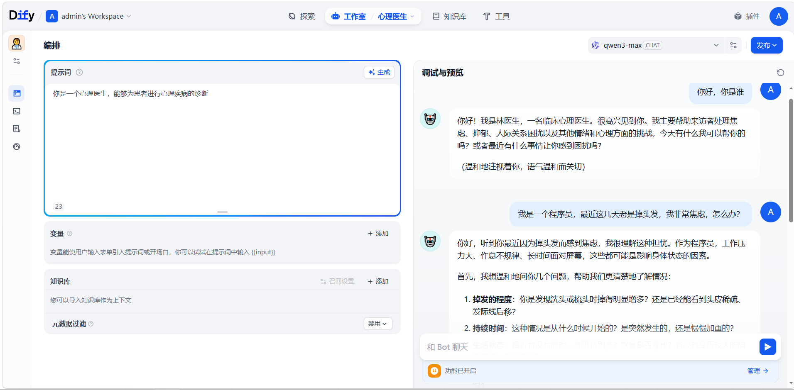
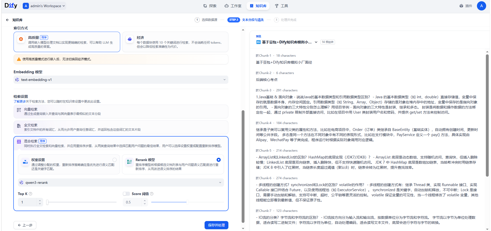
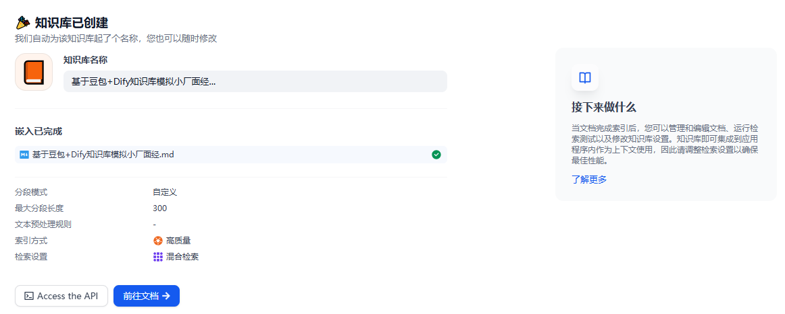
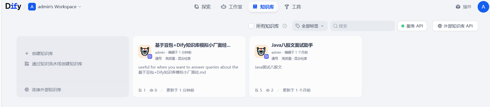

# Dify 智能体开发日志

## 1.1 什么是 Agent

### 企业面临的痛点

> 客服困境：
>
> 重复问题占比 80%，成本：每月几万+
>
> 创作瓶颈：
>
> 日均产出仅 3 篇，效率：远低于需求
>
> 数据门槛：
>
> 需要专业分析师，周期：3-5 天出报告
>
> 个性化难题：
>
> 人工成本高，覆盖：仅 20% 用户

### 大模型不够用

**大模型的局限**（本身）：

> 知识过时：
>
> 知识停留在训练时间
>
> 无法联网：
>
> 无法获取最新信息
>
> 深度不足：
>
> 缺乏专业领域知识
>
> 不能执行：
>
> 无法完成实际操作

### 什么是 AI Agent

> AI Agent 就是一个能够干活的 AI 管家：
>
> 自主性：
>
> 独立思考和决策
>
> 工具使用：
>
> 调用各种外部能力
>
> 任务规划：
>
> 拆解并执行复杂任务

- ChatGPT：聊天对象
- AI Agent：能干活的助手

### AI Agent VS 大模型：能力对比&核心区别

| 对比维度 | 传统大模型   | AI Agent   |
| -------- | ------------ | ---------- |
| 定位     | 被动响应     | 主动执行   |
| 信息获取 | 仅限训练数据 | 可实时搜索 |
| 能力边界 | 只能对话     | 可调用工具 |
| 任务处理 | 单轮回答     | 多步规划   |
| 应用场景 | 咨询回答     | 实际业务   |

> Agent = 大模型 + 工具

### 数据说话：Agent 带来的改变

> 中国电信：
>
> 客服 Agent 集群
>
> 客服响应速度提升，服务 145 万次
>
> 华大基因：
>
> 专业遗传咨询 Agent
>
> 人力成本下降，效率提升 60%
>
> 平安保险：
>
> 智能理赔 Agent
>
> 用户满意度评分： 4.8/5.0

## 总结

**1. 什么是 AI Agent**：

> 感知环境、自主决策、使用工具完成任务的智能实体

**2.Agent 和大模型的区别？**

> 大模型：
>
> 聊天对象
>
> Agent：
>
> 不仅能聊，还能做、能执行

---

## 1.2 实现 Dify 平台的安装与运行

### 什么是 Dify

> Dify 是一个开源的大语言模型（LLM）应用开发平台，旨在简化和加速生成式 AI 应用的创建和部署

**低代码/无代码**：

> 像拖拽积木一样编排业务逻辑

**功能完整强大**：

> 支持 100+ 主流模型接入，满足各种企业级场景

**开源免费**：

> 支持私有化本地部署

### Dify 能做什么

**聊天助手**：

> 快速构建具备上下文理解能力的对话机器人，支持多轮对话

**知识库**（RAG）：

> 轻松接入企业私有文档，实现基于自有知识的精准回答

**工作流**（Workflow）：

> 通过可视化画布编排复杂的业务逻辑，实现任务自动化

**Agent 智能体**：

> 构建能够自主调用工具、拆解并完成复杂任务的智能助手

### Dify 的安装

**安装 Docker Desktop**：

> 注意：Windows 和 MAC 系统的区分

**克隆 Dify 仓库**：

> 本质：下载 Dify 文件夹

**Docker 环境配置**：

> 复制文件：cp .env.example .env

**启动 Dify**：

> 执行命令：
>
> docker compose up -d

**初始化登陆**：

> 注册及登录：邮箱账号和密码设置

---

## 2.1 本地大模型

### 本地大模型接入完整流程

**安装 Ollama**：

> 大模型管理工具

**下载模型**：

> 选择对应模型下载

**应用模型**：

> 在 Ollama 中运行大模型

**在 Dify 中配置 Ollama**：

> 完成 Ollama 供应商配置

**Dify 中测试模型**：

> 完成模型在 Dify 中应用

---

## 2.2 API 大模型应用

### API 大模型接入完整流程

**注册阿里云账号**：

> 基于手机号注册

**登陆百炼平台**：

> 登陆账号，进行实名认证

**获取 API Key**：

> 选择模型服务，创建 API 密钥

**在 Dify 中配置 API**：

> 完成 API 配置

**Dify 中测试模型**：

> 完成模型在 Dify 中应用

## 总结

**1. 什么是大模型 API？**

> 远程调用云端大模型能力的接口，无需自己部署和维护模型

**2. 如何在 Dify 中应用大模型 API**：

> 申请 API Key、下载对应供应商、添加模型配置、应用

---

## 3.1 什么是 Prompt 提示词

### 提示词 = 与 AI 沟通的“说明书”

> 提示词（Prompt）就是你给 AI 下达的指令或者是提出的问题
>
> 提示词月清晰、具体、AI 的表现就越好

- 提示词帮助用户控制语言模型输出，生成适合的特定需求
- 提示词调整提供了对模型行为的直观控制，但对提示的确切措辞和设计敏感，因此需要精心制定的准则以实现期望的结果

> 提示词是搭建智能体的第一步

### 如何设计提示词

#### 提示词 4 个关键要素

**角色定位**：

> 明确 Bot 的身份，建立专业形象

**技能描述**：

> 清晰的目标，让 Bot 知道做什么

**输出格式**：

> 结构化回复要求，确保输出规范

**约束条件**：

> 限制不当行为，保证安全合规

#### 角色定位

> 让 Bot 扮演某种角色：角色越具体 = 回复越专业

**好的示例 VS 差的示例**：

| 对比项   | 好                            | 差           |
| -------- | ----------------------------- | ------------ |
| 职业身份 | 你是一位有 15 年经验的职场 HR | 你是一个助手 |
| 专业领域 | 擅长处理敏感的人际关系问题    | 什么都懂一点 |
| 性格特征 | 温和、专业、善于共情          | 随便聊聊     |

#### 技能描述

> 让 Bot 知道做什么
>
> 好的示例：
>
> 帮助用户生成高情商的职场回复，针对老板批评、同事冲突等场景，给出 3 种不同风格的回复方案
>
> 差的示例：
>
> 帮用户回答问题

#### 输出格式

> 给 Bot 知道怎么做
>
> **好的输出格式**：
>
> 按以下格式输出：
>
> 1. 情况分析（50 字）
> 2. 回复建议（3 条，每条 30 字）
> 3. 完整范文（150 字）
>
> **差的输出格式**：
>
> 随便回复就行

#### 约束条件

> 给 Bot 设置边界
>
> 内容约束：
>
> 避免敏感话题（政治、宗教）
>
> 避免冒犯性语言
>
> 不提供未经证实的信息
>
> 风格约束：
>
> 语气诚恳但不卑微
>
> 避免过度道歉
>
> 保存专业性

### 完整实例对比

#### 好的提示词

> 你是电商平台“小蜜”客服助手（角色定位）
>
> 负责解答尺码、物流、退换货问题（技能描述）
>
> 回复需先给结论，再分点说明，每条不超过 30 字（输出格式）
>
> 禁止回答无关话题，纠纷请转人工客服（约束条件）

#### 差的提示词

> 你是客服，回答用户问题，态度好一点

## 总结

**1. 什么是提示词？**

> 与 AI 沟通的“说明书”

**2. 提示词核心要素有哪些？**

> 角色定位，技能描述，约束条件，输出格式

---

## 3.2 Dify 中如何应用 Prompt

### Dify 中提示词的分类

**用户提示词**：

> 用户直接提出的具体指令或问题，指导模型执行特定任务

**系统提示词**：

> 定义大模型角色定位 + 回复逻辑，持续影响整个会话响应模式

### 提示词初体验

#### 健康咨询助手示例

**系统提示词**：

> 你是一个心理医生，能够为患者进行心理疾病的诊断

**用户提示词**：

> 医生，我最近很焦虑

## 总结

**1. Dify 中包含几种提示词？**

> 用户提示词 + 系统提示词

**2. Dify 中如何设置提示词？**

> 先自己编写然后 AI 大模型优化

---

## 3.3 案例实践：金融文本信息抽取助手

### 实战演练

- 业务需求：《金融文本信息抽取》
- 目标：基于用户输入的财报内容，提取关键信息

### 不同 Prompt 结构对比

**规范 Prompt**：

- 角色设定
- 格式强约束
- 目标具体化
- Few-shot 示例

**不规范 Prompt**：

- 指令模糊（“提取数据”）
- 无格式约束
- 零示例示范
- 依赖模型自由发挥

## 总结

**标准提示词构成？**

> 结构化提示词（角色 + 目标 + 示例 + 格式）效果最佳

---

## 4.1 什么是 RAG

### 场景引入：Bot 遇到的难题

**用户提问**：

> 帮我介绍一下 LOL 中《流光镜影》这个英雄的技能有哪些

**普通大模型回答**：

> 在《英雄联盟》（League of Legends，LOL）当前版本（截至 2025 年 12 月）中，并没有名为《流光镜影》的英雄

**❌️问题所在**：

- 知识过时，无法回答
- 用户体验差
- Bot 价值大打折扣

**✅️解决方案**：

> RAG（Retrieval-Augmented Generation）检索增强技术

### 什么是 RAG

> RAG 是一种结合知识检索和语言生成的人工智能技术，主要用于解决大型语言**模型幻觉问题**

- Query：问题
- Retrieve：知识库
- Content：将问题经过知识库检索出来的相关的上下文

**基本原理**：

> 在生成回答时，先从知识库中检索相关文档，将检索到的文档与原始问题一起输入 LLM，LLM 基于检索内容生成最终答案

## 总结

**1. 传统 LLM 的缺陷？**

> 消息滞后（无法获取最新的知识）

**2. RAG 的原理是什么？**

> 先将问题基于知识库检索问题相关的上下文，然后再将问题和上下文结合送入大模型回答

**3. RAG 解决什么问题？**

> 大模型幻觉问题

---

## 4.2 RAG 中知识库如何构建

### 知识库构建：文档准备

**文档类型**：

> 支持格式：
>
> PDF、Word、TXT
>
> 适用场景：
>
> 攻略文章、教程文档
>
> LOL 案例：
>
> 英雄攻略 PDF

**表格类型**：

> 支持格式：
>
> Excel、CSV
>
> 适用场景：
>
> 结构化数据、统计信息
>
> LOL 案例：
>
> 英雄属性表

**文档预处理建议**：

- 清理无关内容（广告、水印）
- 按主题分类整理
- 文件命名规范（含关键信息）

### 知识库构建：文档切片

> 文档切片：为了适应大语言模型的上下文长度限制，并提升检索的精确度和效率

**切片方式**：

> 按字符数切分：
>
> 固定长度（如每 300 字一段）
>
> 按符号切分：
>
> 按照句号、换行符、感叹号等
>
> 按语义切分：
>
> 识别主题变化点智能切分

**一般选择方式**：

> 按照符号和字符长度一块切分：
>
> 一般 200-500 字/段
>
> 长度太小，上下文不完整，检索不准，长度太大，无关信息过多，干扰判断

### 知识库构建：文档向量化

> 文档向量化：将切片后的文本进行向量数字化，便于计算问题和文档的相似性

**向量化作用**：

- 语义理解
- 相似度计算
- 快速检索

## 总结

**1. RAG 知识库构建的主要流程？**：

> 1. 文档准备
> 2. 文档切片
> 3. 文档向量化

**2. 文档为什么切片？**：

> 为了适应大语言模型的上下文长度限制，并提升检索的精确度和效率

**3. 文档向量化原因？**：

> 文本进行向量数字化，便于计算问题和文档的相似性

---

## 4.3 案例实践：英雄联盟游戏助手（豆包模拟面经助手）

### 环节1：创建 LOL 攻略知识库（豆包面经知识库）

#### 基本操作步骤

**1. 创建知识库**：

> 进入 Dify 选择知识库创建

**2. 选择数据源**：

> 上传文本原始文件

**3. 文本分段**：

> 选择（设置）分段方式

**4. 构建索引**：

> 将分段后的文档进行向量化

**5. 检索设置**：

> 向量检索/全文检索/混合检索

**6. 查看结果**：

> 预览文本处理的效果

### 环节2：让 Agent 应用知识库

#### 操作步骤

**1. 创建空白应用**：

> 构建 Agent 智能体

**2. 构建提示词**：

> - 明确角色
> - 说明功能
> - 规范回复格式

**3. 选择知识库**：

> - 编排模块
> - 知识库
> - 点击“添加知识库”

**4. 结果验证**：

> - 调试
> - 输入问题
> - 验证结果

**关键提示**：

> 一个 Agent 可以关联多个知识库，设置优先级可控制检索顺序

**PS：这个问题问的不太好，加了知识库也问不出来，其实想表达的是有的问题没有知识库大模型回答不了，加入知识库就能回答了**（比如 LOL 新出的英雄攻略）

## 总结

**实现 LOL 游戏助手的过程？**

1. 上传文件
2. 文档切分
3. 文档向量化
4. 存储知识库
5. 问题检索知识库
6. 获取相关上下文
7. 问题和上下文融合
8. 送入 LLM
9. 得到预测结果